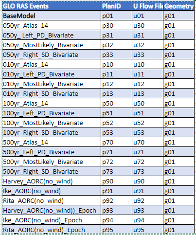
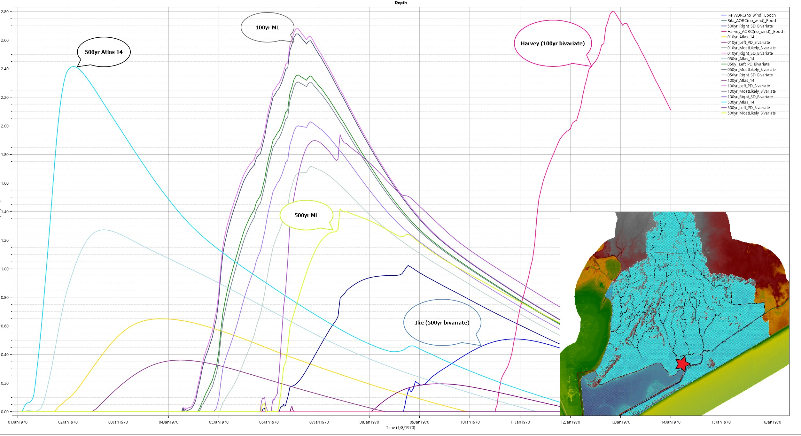

# RAS QualComp

### A RAS 2D QA/QC Visualization Tool

https://github.com/mylesmc123/RAS_2d_qaqc.git

#### Author: Myles McManus, TWI mmcmanus@thewaterinstitute.org
#### Date: 2023-09-01

## Background

For the RAS 2D GLO Model, a bivariate compound flood modeling approach is used. This involves using historical surge data combined with propabalistic based rainfall.

AEP Rainfall has been run for three different flood drivers: Most Likely, Surge Dominant, and Precip Dominant. Precipation data has been run for these 3 drivers for each AEP event.

The AEP events run include: 10, 50, 100, and 500 year return events.

In addition to the bivariate AEP events, Atlas 14 Everywhere Precip events were run for the same AEPs.

Historic events associated with the historic bivariate surge data was also run.

A summary of the events is shown below:

Initial uncalibrated results, suggest some discrepancies between AEP events and expected results as shown in the figure below:

## Purpose

The purpose of this QAQC is to compare the results of the bivariate compound flood modeling approach to the Atlas 14 and historic events. This will be done by comparing the water surface elevations at the same locations and looking at a animation of the precipitation as it occurs over the watershed.

## Methodology

The QAQC will be done using the following steps:

1. Create a grid of points to pull timeseries WSE data from within the model domain.
2. Pull timeseries data for each point location.
3. Plot the timeseries data for each point location along with a reference to the location on a map.
4. Create an animation of the precipitation as it occurs over the watershed.
5. Compare the results of the bivariate compound flood modeling approach to the Atlas 14 and historic events.

## Data

### QAQC Points

The qaqc points.geojson was generate via RAS Mapper and QGIS using the following steps:

Used RAS Mapper to export mesh.shp.

Used the QGIS tool called "Regular Points" o mesh.shp to create points.geojson.

Then deleted points that were outside of mesh.shp.

And labeled The QAQC points.

### WSE Timeseries Data to a Event-Based Json file contained WSE data for each point.
This data was generated using "points_to_event_wse_json.py"

#### points_to_event_wse_json.py

This script reads WSE data from a set of HEC-RAS HDF plan files determined by a CSV file: "Z:\py\RAS_Bivariate_Analysis\data\GLO RAS Model Runs Distribution to Modelers.csv

For each HDF, the nearest QAQC points on the RAS Mesh were found and extracted to an event-based Json File containing WSE data for each QAQC point.

#### Map.js

The results have been published to the following website: 
https://glo-bivariate-results.onrender.com/index.html

This script is used to produce a map of teh QAQC points, and when a point is clicked, reads the event-based Json file and plots the WSE data for each QAQC point on the map.

### WSE Timeseries Data to each point across all events.
This data was generated using "dev_wse_map_points_from_event_jsons.ipynb" and is added to the website using the top toolbar to navigate to "Max WSE Across Events". 

This figure allows us to view trends in the data for points across the events by using only the maximum WSE for a point across each event.

## Results

The results have been published to the following website: 
https://glo-bivariate-results.onrender.com/index.html

The results of the analysis suggest that the bivariate compound flood modeling approach is producing reasonable results based on the data input into the model. There is a limited set of downstream boundary condition surge data being used from ADCIRC output for particular historic events. This limited set of ADCIRC data caused multiple AEP events to use the same surge data as showin in the following table:

 In addition the Historic events selected to use for the Surge data for the AEP events have lower Surge values than the AEP should have according to the bivariate anaylsis performed by Iowa University to develop the bivariate rainfall data as shown in the figure below:

Results of the bivariate modeling of NTR and precipitation for Rollover Pass. The diamonds represent the most likely design event for different return periods (see Table 5 2 for their values), while the triangles represent the values under the assumption of full dependence. The black circles represent two additional design events that can be considered for hydrologic simulations (see Table 5 2 for their values). The relative likelihood of an event on an isoline is represented by the colored contours (i.e., the redder the more likely). The historical TCs that are the closest to a given AEP are shown in the text boxes; the grey boxes indicate storms/AEPs that are used for the creation of the design events, while the white boxes are for storms/AEPs for which the results for High Island are used.